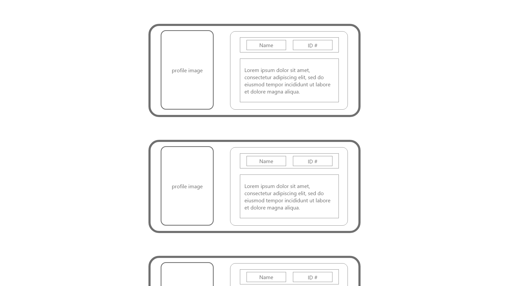
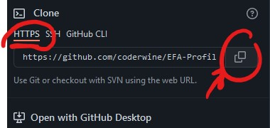
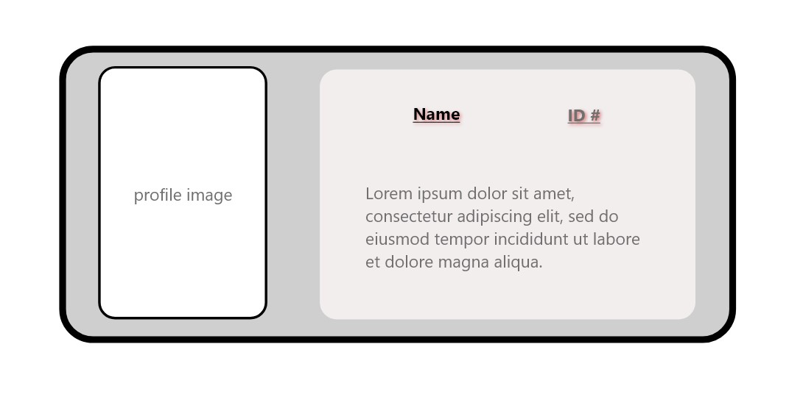

# Profile Card Challenge Solution

## Wireframe

The above image displays a wireframe of what this page should look like. You can also view this wireframe within the assets folder as a PDF or PNG.

## Main Goal
We are looking to have at least 3 cards created that displays a profile picture, their name, an ID number (can be whatever you'd like), and descriptive text, which can be a lorem ipsum filler.

---

## Getting Started
You will need to clone this repository onto your workstation. 

You can do this simply by copying this command in your desired folder location:

`
git clone https:[filler text]
`

This can also be done by clicking the **"Code" Green Button**. You will then need to click the copy button and paste that in your terminal in your desired location on your workspace.

ex:

---
## Challenge Requirements
You will need to following the design of the wireframe, considering the general layout. 
- A profile picture will display on the left (all images are provided within the assets folder)
- Name and ID should be *bold* black color - consider what sort of tags may be useful for this display, underlined, and given a drop shadow of a different color.
- There should be a border around the profile picture as well as the main card.

### Example End Result:

---
## Where to Start
- Consider the wireframe. 
- How are items laid out?
  - What sort of containers should be nested within eachother?
- What type of containers should we use?
- What is flex?

**Good Luck!**